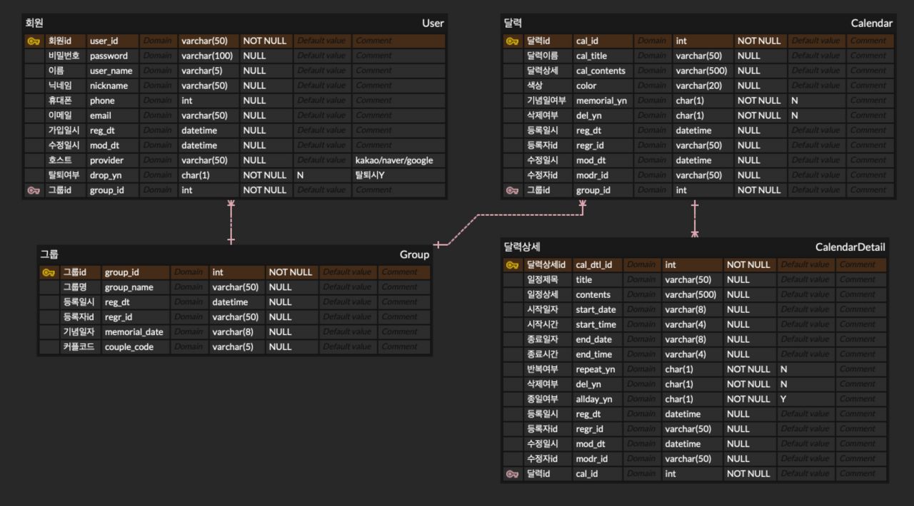
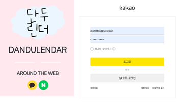
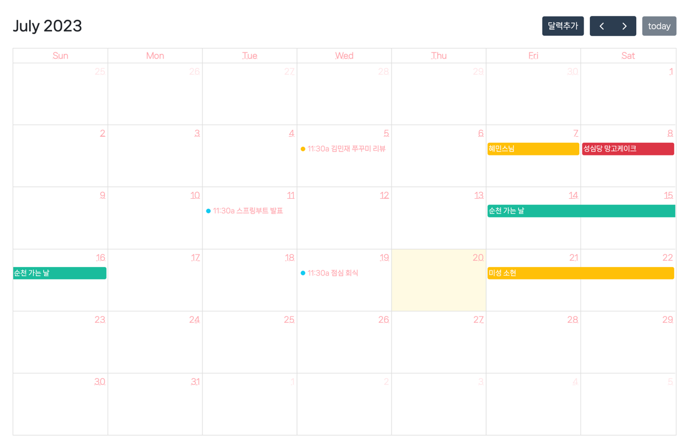

# 단두린더
단둘이서 단두린더

----
커플이 사용 가능한 둘만의 캘린더로 개인 일정과 커플 일정 공유 웹 서비스

개인 일정 서비스, 기념일 서비스, 커플 일정 서비스를 하나로 통합하여 기능 구현

### 기술 스택
- Java 11
- SpringBoot
- Spring Data JPA
- Gradle
- MySQL
- AWS
- TypeScript
- Spring Security
- OAuth2
- Spring Data JPA
- Full Calendar

### 주요 기술
- [서비스 기획부터 데이터 모델링, 기타 프로젝트 설정까지 전담하여 업무 수행](https://duburani.tistory.com/26)
  - 
- [Spring Security를 적용하고 OAuth2를 활용해 회원가입, 로그인 기능 구현](https://duburani.tistory.com/30)
  - 
- [fullCalendar API를 활용하여 달력 구현](https://duburani.tistory.com/28)
  - 
- [QueryDSL를 활용하여 복잡한 쿼리 조회](https://duburani.tistory.com/42)